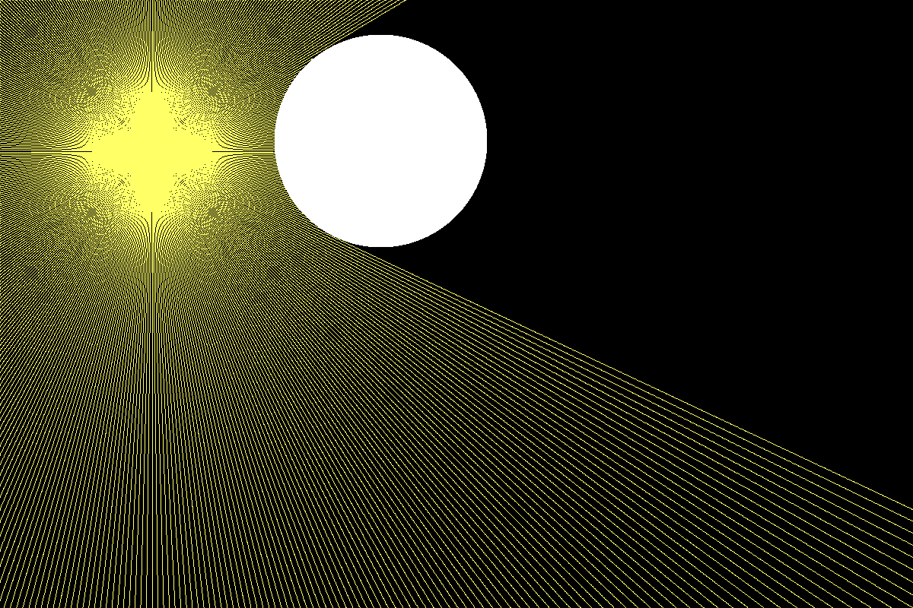

# 2D Ray Tracing 



A small program written in C that simulates basic incomplete 2D ray tracing. This was built as a learning project to better understand ray casting and simulation loops in C.


## Features

- 2D ray casting 
- Wall collision detection

## Build && Run

```bash
make
./raytracing
```
